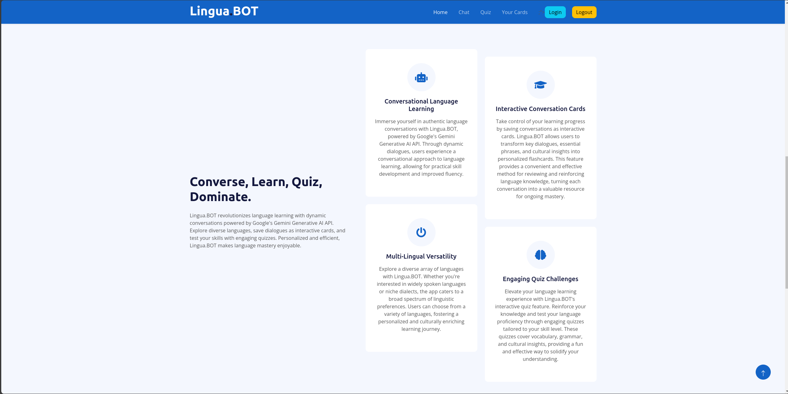

# LinguaBOT

# Inspiration

Our inspiration for Lingua.BOT came from the desire to revolutionize language learning. We envisioned a dynamic and engaging platform that leverages cutting-edge technology, such as Google's Gemini Generative AI API, to provide users with an immersive and personalized language learning experience.

# What it does

LinguaBOT is a web application meticulously crafted to enhance language learning through dynamic chat sessions and quizzes. Fueled by the powerful capabilities of Google's Gemini Generative AI API, users can immerse themselves in conversations in their target language, enabling practical and real-world language application. The application takes advantage of the API to dynamically generate quizzes and chat interactions, ensuring a personalized and adaptive learning experience. MongoDB plays a crucial role in storing user-generated notes and quiz data, establishing a robust foundation for a comprehensive and personalized learning environment.

# How we built it

The development of Lingua.BOT involved a combination of Python, Flask for the backend, Bootstrap for the frontend, and Taipy Python for creating a seamless GUI for the chat interface. MongoDB was integrated to efficiently manage and store user notes and quiz data. Authentication is handled through Auth0, ensuring a secure and personalized experience for each user.

# Challenges we ran into

Building Lingua.BOT presented its share of challenges. Integrating the Gemini Generative AI API seamlessly into the chat interface required careful consideration of both frontend and backend components. Additionally, ensuring the smooth functionality of the MongoDB database for note and quiz storage posed its own set of challenges. Overcoming these obstacles required collaborative problem-solving and a deep dive into the intricacies of the technologies involved.

# Accomplishments that we're proud of

Despite the challenges, we are proud to have created a language learning platform that merges state-of-the-art AI with user-friendly design. Lingua.BOT empowers users to practice language skills in an interactive manner while also offering the capability to store personalized notes and track progress through quizzes. The integration of Auth0 ensures a secure and seamless authentication process, enhancing the overall user experience.

# What we learned

Through the development of Lingua.BOT, we gained invaluable insights into the complexities of integrating advanced AI APIs, managing databases, and ensuring a secure authentication process. The project not only honed our technical skills but also deepened our understanding of user-centric design in educational technology. Lingua.BOT taught us the importance of innovation, collaboration, and perseverance in tackling complex challenges.

# Screenshots

## Main Page

## Login

## Chat

## Quiz

